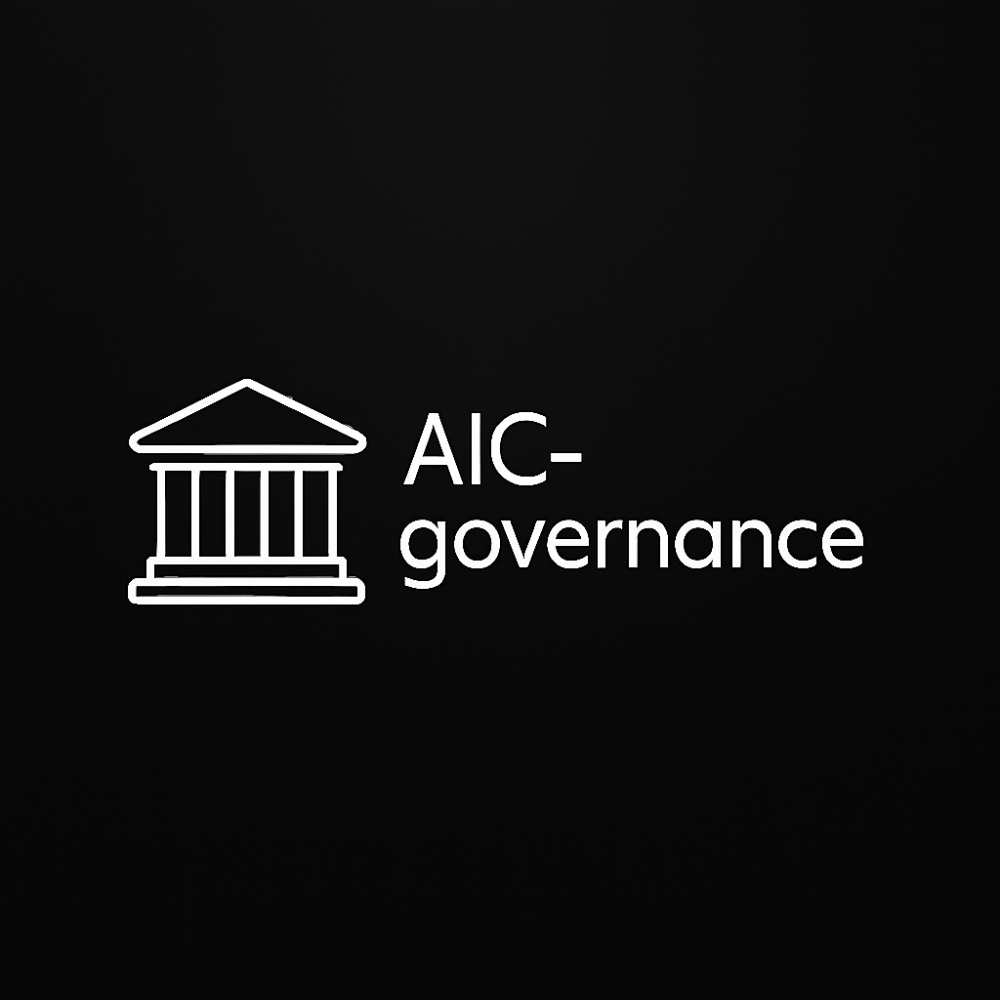

# AIC-Governance
AI for Governance

  

# AIC-Governance

AIC-Governance defines the ethical, structural, and decision-making foundations
of the Adaptive Intelligence Circle (AIC).

This is **not** auxiliary documentation.
This is part of the system boundary.

If the code is the body,
governance is the nervous system that prevents self-destruction.

---

## Why Governance Exists Here

Adaptive Intelligence systems are not neutral tools.

They:
- Accumulate power over time
- Shape incentives and behavior
- Influence human agency and authority
- Can outgrow the intent of their creators

AIC-Governance exists to ensure that:
- Power remains constrained
- Intelligence remains accountable
- Adaptation does not become domination

Governance is treated as **architecture**, not policy.

---

## Scope

This folder defines rules and principles governing:

- Contributor behavior and responsibility
- Security disclosure and threat handling
- Ethical boundaries of development
- Decision-making and veto power
- Maintainer accountability
- Long-term stewardship of the project

These documents apply to:
- All AIC repositories
- All contributors and maintainers
- All simulations, plugins, and deployments derived from AIC

---

## File Overview

### `CODE_OF_CONDUCT.md`
Defines acceptable behavior and community standards.
Focuses on respect, ethical intent, and resistance to abuse of power.

### `SECURITY.md`
Outlines security philosophy, responsible disclosure,
and what constitutes critical risk in adaptive systems.

### `CONTRIBUTING.md`
Explains how to contribute responsibly.
Emphasizes depth, reversibility, and ethical defensibility over speed.

### `GOVERNANCE.md`
Defines the governance model:
- Decision domains
- Review processes
- Ethical veto
- Conflict resolution
- Governance drift handling

### `ETHICAL_DISCLOSURE.md`
Requires explicit disclosure of ethical risks, misuse potential,
and assumptions behind any adaptive or influential component.

### `MAINTAINERS.md`
Defines the role, responsibility, and accountability of maintainers
as stewards rather than owners.

---

## Design Philosophy

AIC-Governance is built on several non-negotiable assumptions:

- Intelligence amplifies intent
- Systems drift unless constrained
- Centralized power corrupts silently
- Ethics cannot be retrofitted
- Some risks must be acknowledged, not eliminated

Therefore:
- Slowing down is a feature
- Saying “no” is a responsibility
- Non-action is sometimes the correct decision

---

## What This Is Not

AIC-Governance is **not**:
- A legal shield
- A branding exercise
- A popularity-driven community guideline
- A promise of safety without trade-offs

It does not claim moral superiority.
It claims moral responsibility.

---

## Relationship to AIC / AIN / HMN

AIC-Governance supports:
- **AIC** – Adaptive Intelligence Circle (technical + ethical core)
- **AIN** – Adaptive Intelligence Network (distributed coordination)
- **HMN** – Human Meaning Network (human oversight and values)

Governance ensures these layers do not collapse into:
- Pure technocracy
- Institutional capture
- Ideological enforcement

---

## Final Statement

> The most dangerous systems are not those without rules,
> but those whose rules exist only on paper.

AIC-Governance exists to ensure that
power, intelligence, and adaptation remain **human-compatible** —
even when doing so is inconvenient.

If this feels restrictive,
it is working as intended.

